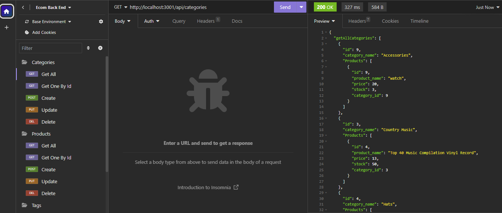

# e-com-back-end

## Table of Contents

[Description](#description)

[Demo](#demo)

[Installation](#installation)

[Usage](#usage)

[Contribution](#contribution)

## Description

Welcome to the e-commerce repository, this project is the back end for an e-commerce website using one-to-many and many-to-many database relationships with Sequelize and MySQL. Using Insomnia, follow the routes below to display,filter and update the database information for categories, products, and tags.

Technologies Used include:

- Node.js
- MySQL
- Sequelize
- Express.js
- Insomnia

Follow link for GitHub repository
[e-com back-end](https://github.com/brandonlambrecht/e-com-back-end)

API routes:

GET

    localhost:3001/api/categories
    localhost:3001/api/categories/:categoryID
    localhost:3001/api/products
    localhost:3001/api/products/:productID
    localhost:3001/api/tags
    localhost:3001/api/tags/:tagID

POST

    localhost:3001/api/categories
    localhost:3001/api/products
    localhost:3001/api/tags

PUT

    localhost:3001/api/categories/:categoryID
    localhost:3001/api/products/:productID
    localhost:3001/api/tags/:tagID

DELETE

    localhost:3001/api/categories/:categoryID
    localhost:3001/api/products/:productID
    localhost:3001/api/tags/:tagID

## Demo

Link here for [demo](https://drive.google.com/file/d/1AwCd3a4faUniCHm6SuoXfNaX9FkTIX96/view) on how to use application.

## License

None

## Installation

To install necessary dependencies, run the following command:

    npm i

## Usage

To use the application type the following into the terminal

    npm run watch

The application is ran through Insomnia, see demo link for step by step

## Contribution

Open to any suggestions to improve the project. Create an issue with the description contribution and lets work together.
